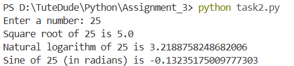

# Assignment 3 - TuteDude Python Course

This folder contains solutions for Assignment 3 of the TuteDude Python course (Module 2).

## Tasks

1. task1.py — Calculate Factorial Using a Function
   - Description: Prompts the user for a non-negative integer and computes its factorial using a user-defined function.

2. task2.py — Using the Math Module for Calculations
   - Description: Demonstrates use of the Python `math` module. The program reads a number and prints its square root, natural logarithm, and sine (in radians).

## How to run

Open a terminal, navigate to this folder, and run the desired script with Python 3.x. Example (PowerShell):

```powershell
cd Assignment_3
python task1.py
python task2.py
```

## Program Outputs

- Task 1 (Factorial) output:
  

- Task 2 (Math module calculations) output:
  

## Notes

- `task2.py` uses functions from the `math` module; make sure Python's standard library is available (it is by default).
- If `task1.py` does not handle invalid input yet, I can add input validation and tests.
- Keep the `Outputs/` directory with the referenced screenshots so images render correctly on GitHub.

## Author

aragrishah
