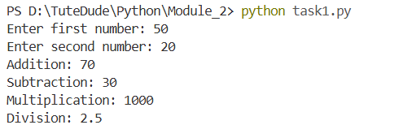
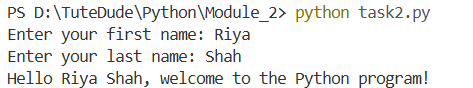

# Python Basic Tasks

This repository contains basic Python programming tasks implemented as part of the TuteDude Python Module 2.

## Tasks Overview

### 1. Basic Calculator (task1.py)
A simple calculator program that:
- Takes two numbers as input from the user
- Performs basic arithmetic operations:
  - Addition
  - Subtraction
  - Multiplication
  - Division
- Displays the results of each operation

### 2. Personalized Greeting (task2.py)
A program that:
- Asks user for their first name and last name
- Concatenates the names
- Displays a personalized welcome message

## How to Run

1. Make sure you have Python installed on your system
2. Clone this repository
3. Navigate to the Module_2 directory
4. Run the programs using Python:
   ```
   python task1.py
   python task2.py
   ```

## Features
- User input handling
- Basic string operations
- Arithmetic operations
- String concatenation
- Print formatting

## Program Outputs

### Calculator Program Output


### Greeting Program Output


## Author
aragrishah

## Repository Structure
```
Module_2/
├── README.md
├── task1.py
└── task2.py
```
